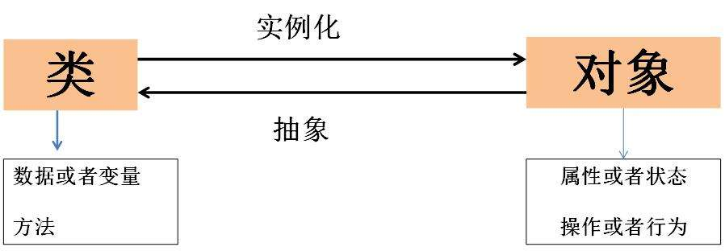

# Python 中的类

## 一 类与对象

### 坑

### 笔记：

如果你不确定一个对象的类型，你可以询问： 

```python
>>> type(p)
<class '__main__.Point '>
```

你也可以用 isinstance 来检查某个对象是不是某个类的实例。 

```python
>>> isinstance(p, Point)
True
```

如果你不确定一个对象是否拥有某个属性，你可以使用内置函数 hasattr 检查：

```python
>>> hasattr(p, 'x')
True
>>> hasattr(p, 'z')
False
```

## 二 类与函数

### “原型与补丁”开发方案

**“原型与补丁”**开发方案，是指：

>    **针对每个函数，编写一个可以基本运行的原型并对其测试，逐步修正错误。**

```python
class Time:
    """ 
    Represents ␣ the ␣ time ␣ of ␣ day.
    
    attributes: ␣ hour , ␣ minute , ␣ second
    """
time = Time()
time.hour = 11
time.minute = 59
time.second = 30
```


```python
# 练习：接收一个 Time 对象并用 时:分:秒 的格 式打印它。
def print_time( time):
     ''' 
     print instance of Time class by hour:minute:second
     '''
     print('%.2d:%.2d:%.2d'% (time.hour,time.minute,time.second))
```

```python
# first version
def add_time(t1,t2):
    sum = Time()
    sum.hour = t1.hour + t2.hour
    sum.minute = t1.minute + t2.minute
    sum.second = t1.second + t2.second
    return sum
  
# second version
def add_time(t1, t2):
    sum = Time()
    sum.hour = t1.hour + t2.hour
    sum.minute = t1.minute + t2.minute
    sum.second = t1.second + t2.second
    
    if sum.second >= 60:
        sum.second -= 60
        sum.minute += 1
        
    if sum.minute >= 60:
        sum.minute -= 60
        sum.hour += 1
    return sum
```

代码开始时候的问题：

```python
# first version
def increment(time, seconds):
  '''
  '''
     time.second = seconds
     if time.second >=60:
         time.second -= 60
         time.minute += 1
     if time.minute >= 60:
         time.minute -= 60
         time.hour += 1

In [49]: increment(time,3600)

In [51]: print_time(time)
(13:03:3540)

```

```python
# second version
def increment2(time, seconds):
     time.second = seconds
    
     while time.second >=60:
         time.second -= 60
         time.minute += 1
     while time.minute >= 60:
         time.minute -= 60
         time.hour += 1
          
In [48]: print_time(time)
(13:02:00)
```

#### 纯函数 VS 修改器

函数：函数一般除了返回的内容之外，并不会修改中间处理的数据。

修改器：直接修改参数传入的对象。


优劣：

1.   任何能够用修改器实现的函数，同样能够用纯函数实现
2.   一些证据表明，纯函数实现的程序比修改器实现的函数开发更快，更不容易出错
3.   但有时候修改器是很方便的，而函数式程序效率反而不高。

#### **函数式编程风格**：

>   1.   只是在合理情况下，都是用纯函数方法编写
>   2.   只在有完全令人信服的原因下采用修改器

### 原型 V.S. 方案

#### 1. 原型+补丁

 **针对每个函数，编写一个可以基本运行的原型并对其测试，逐步修正错误。**这种方案是非常符合直观的，但是也存在很多弊端。

*   优势：
    -   在对问题没有深入理解时，特别有效。

*   劣势：

    *   增加修正可能导致代码过度复杂，因粗需要处理许多特殊情况。

    *   很不可靠，很难知道是否已经找到了所有的错误。

#### 2. 设计开发(designed development)

对问题有高层次的理解，能够使得开发变得更容易。**即通过对问题的抽象，从更高维度寻求普遍的求解思路。**

以时间处理为例，小时/分钟/秒，其实可以理解为不同进制的秒，一分钟代表60秒，一小时代表3600秒。因此，我们可以把`Time`对象转化为整数，毕竟计算机擅长做整数运算。

```python
def time_to_int(time):
    minutes = time.hour* 60 + time.minute
    seconds = minutes * 60 + time.second
    return seconds
  
def int_to_time(seconds):
    time = Time()
    minutes,time.second = divmod(seconds, 60)
    time.hour, time.minute = divmod(minutes, 60)
    return time
  
def add_time(t1, t2):
  '''
  抽象版的时间相加函数。
  '''
    seconds =  time_to_int(t1) + time_to_int(t2)
    return int_to_time(seconds)
```

这种抽象，将会带来处理方式的优雅。抽象能够从根本上解决问题，从而避免很多开发上的问题。


## 三 类与方法

### 3.1 面对对象的特性

`Python` 是一门面对对象的编程语言（object-oriented programming language,OPL）。这使得`Python`支持面对对象编程的特性：

*   程序包含类和方法定义。
*   大部分计算以对象上的操作表示
*   对象通常代表现实世界的问题，方法对应现实世界中物体交互的方式。

虽然我们完全可以不用这些特性，但是大多数情况下，这些替代语法更为简洁，更准确地表达了程序的结构。




例如，在 `Time1.py` 中，类定义与之后的函数定义之间没有明显的联系。仔细检查之后，才 会发现每个函数都至少接受一个 `Time` 对象作为参数。

从这个观察中我们发现了*方法* ；**方法是一个与特定的类相关联的函数**。虽然函数与方法的语义相同，但是有两处用法上的不同：

*   方法在一个类定义内部声明，为的是显示地与类进行关联。

*   调用方法的语法和调用函数的语法不同。

下面我们来深入了解方法。

### 3.2 函数转化为方法

之前采用函数式方法来处理时间这个类。

```python
class Time:
    """ 
    Represents ␣ the ␣ time ␣ of ␣ day.
    
    attributes: ␣ hour , ␣ minute , ␣ second
    """
    
def print_time( time):
     ''' 
     print instance of Time class by hour:minute:second
     '''
     print('%.2d:%.2d:%.2d'% (time.hour,time.minute,time.second))
```

针对生成的`Time`类的实例，我们需要将实例作为参数传入函数才可以。

```python
time = Time()
time.hour = 11
time.minute = 59
time.second = 30

print_time(time)
# (11:59:30)
```

在面对对象编程中，在类的设计之初，我们便可直接将这个函数作为这个类的一个特性声明出来:

```PYTHON
class Time:
   
    def print_time(time):
         ''' 
         print instance of Time class by hour:minute:second
         '''
         print('%.2d:%.2d:%.2d'% (time.hour,time.minute,time.second))
```

下面有两种调用方式：

第一种（不常用）使用函数的语法：

```python
In [71]: Time.print_time(time)
09:45:00
```

`Time`是类的名称，`print_time`是方法的名字，`time`是传递的参数。这句话是，针对变量`time`，进行`Time`类中`print_time`的处理方法。

第二种是，使用方法语法：

```python
time = Time()
time.hour = 11
time.minute = 59
time.second = 30

In [74]: time.print_time()
11:59:30
```

在这个点标记法的用法中，`print_time` 是方法的名称，然后 `start` 是调用方法的对象，被称为`主语 (subject)`。就像一个句子的主语是句子的核心，方法的主语也是方法作用的 主要对象。

在方法中，主语被赋值为第一个参数，所以在这里 start 被赋值给 time 上了。


根据约定，方法的第一个参数写作 self ，所以 print_time 写成这样更常见： §

```python
class Time:
    def print_time(self):
        print('%.2d:%.2d:%.2d' % (self.hour , self.minute , self.second))
```

使用该约定原因在于一种暗喻：

*   在函数调用的语法中，print_time(start) 表示函数是一个活跃的代理。就像是在说

>   “Hi, print_time! 这有一个对象需要你打印’’。

*   在面向对象编程中，对象是活跃的代理。一个类似 start.print_time() 的方法调用，

>   就像是在说 “Hi start! 请打印你自己’’。

视角的转换似乎让语气变得更文雅些了，但很难看出其好处。在前面的例子中，的确如此。**但是将职责从函数上面转移到对象上，可以更加容易地写出多样化的函数 (或方法)， 并且代码将更加容易维护和复用。**

####  3.2.1 例子

进一步添加之前的函数：

```python
class Time:
    def print_time(self):
        print('%.2d:%.2d:%.2d' % (self.hour , self.minute , self.second))
    
    def time_to_int(self):
        minutes = time.hour* 60 + time.minute
        seconds = minutes * 60 + time.second
        return seconds
    
    def increment(self, seconds):
        '''在时间上面添加秒，并返回结果'''
        seconds += self.time_to_int()
        return int_to_time(seconds)
```


```python
start = Time()
start.hour = 11
start.minute = 59
start.second = 30

In [84]: start.print_time()
11:59:30

In [85]: end = start.increment(1337)# 主语 start 被赋值给第一个形参 self。实参 1337 被赋值给第二个形参 seconds 。

In [86]: end.print_time()
12:21:47
```

这个机制有时会把人弄晕，尤其是你犯错的时候。例如，如果你使用两个实参调用 increment，你会得到：

```python
In [88]: end = start.increment (1337 , 460)
---------------------------------------------------------------------------
TypeError                                 Traceback (most recent call last)
<ipython-input-88-07b777b691ba> in <module>
----> 1 end = start.increment (1337 , 460)

TypeError: increment() takes 2 positional arguments but 3 were given
```

#### 3.2.2 init方法

init 方法 (“initialization’’ 的简称) 是一个特殊的方法，**当一个对象初始化的时候调用**。 它的全名是 __init__ (两个下划线后加 init 再加两个下划线)。一个 Time 类的 init 方法看 起来像是这样的：

```python
# inside class Time:
    def __init__(self , hour=0, minute=0, second =0):
        self.hour = hour
        self.minute = minute
        self.second = second
```

#### 3.2.3 \_\_str\_\_方法

\_\_str\_\_ 是一个和 \_\_init\_\_ 方法类似的特殊方法，返回一个对象的字符串表现形式。

```python
# inside class Time:

    def __str__(self):
        return '%.2d:%.2d:%.2d' % (self.hour , self.minute , self.second)
```

当你`打印 (print)` 一个对象，Python 调用 `str `方法：

```python
class Time:
    def __init__(self , hour=0, minute=0, second =0):
        self.hour = hour
        self.minute = minute
        self.second = second
        
    def __str__(self):
        return '%.2d:%.2d:%.2d' % (self.hour , self.minute , self.second)
      
    def print_time(self):
        print('%.2d:%.2d:%.2d' % (self.hour , self.minute , self.second))
    
    def time_to_int(self):
        minutes = time.hour* 60 + time.minute
        seconds = minutes * 60 + time.second
        return seconds

    def int_to_time(seconds):
        time = Time()
        minutes,time.second = divmod(seconds, 60)
        time.hour, time.minute = divmod(minutes, 60)
        return time

    def increment(self, seconds):
        '''在时间上面添加秒，并返回结果'''
        seconds += self.time_to_int()
        return int_to_time(seconds)
    
        
      
```

